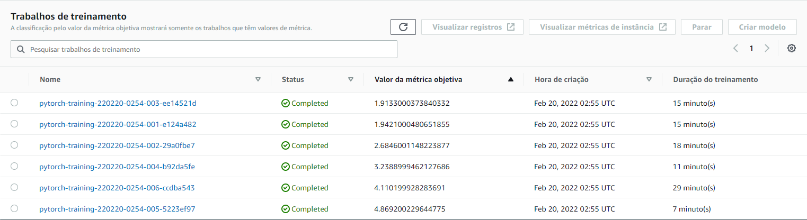

### Table of Contents

 1. [Installation](#installation)
 2. [Project Motivation](#motivation)
 3. [File Descriptions](#files)
 4. [Results](#results)
 5. [Licensing, Authors, and Acknowledgements](#licensing)

## Installation <a name="installation"></a>

 The necessaries modules to run this project are:

 - torch
 - torchvision
 - os
 - io
 - numpy
 - matplotlib
 - pandas
 - numpy
 - sagemaker
 - boto3
 - smdebug
 - PIL
 - mpl_toolkits

 These modules, if not native to the python version being used, can be installed via the terminal using "pip install <module name>" (e.g. pip install torch).

 The code should run with no issues using Python versions 3.*.

## Project Motivation<a name="motivation"></a>

 This machine learning project consists in the creation and training of a dog breed classifier
 using pretrained convolutional networks.

 The dataset used for this project can found in this [link](https://s3-us-west-1.amazonaws.com/udacity-aind/dog-project/dogImages.zip). The data was divided into three datasets (train, test and evaluation) divided by folders representing the different dog breeds.

 The pretrained model chosen for this projet was ResNet50.

 The main learning goals for this project were:
 - Perform hyperparameter optimization on the pretrained imported model (by fine-tuning parameters like learning rate of the model)
 - Observe instance metrics and model variables throughout training using sagemaker profiler and debugger (smdebugger)
 - Deploy the optimized model to a Sagemaker endpoint and query it in order to obtain predictions

 A diagram of the project summarizing the objectives and workflow can be seen below:
 


## File Descriptions <a name="files"></a>

List of files:

 - train_and_deploy.ipynb: Jupyter notebook used to download data, create models, define hyperparameters tuning search space, extract information, create profiler and debugger reports, deploy models and query the endpoint.
 - hpo.py: Python training script used for hyperparameter optimization.
 - train_model.py: Python training script used for profiler and debugger insertion.
 - inference.py: Python script used for the creation of the PyTorch model deployed to the endpoint. It contained the rules for how the model would be handled by Sagemaker, how the prediction requests would be processed by Sagemaker and delivered to the deployed model and the transformations that the input data for the predictions would undergo in order to be used by the model.

 Markdown cells and comments in code cells present in the train_and_deploy notebook were used to assist the understanding of the code.

## Results<a name="results"></a>

The hyperparameters iterated over during optimization were: learning rate, epochs and training batch size and the observed variable used for definition of the best model was average test loss. The results of the process is shown below:



Details of the hyperparameter optimization development can be observed in its section in the project notebook.

The Cloudwatch logs for the best optimization training job is also shown:


The low accuracy value is due to training in a smaller portion of the training dataset. This decision was made in order to reduce AWS instance costs. When compared to the other training jobs, this was considerably better and. As a study, these results served the desired purpose.

The results for the debugger observed variable (CrossEntropyLoss_output):


The profiler report is displayed in the project notebook.

The model deployed to the endpoint was tested using images present of the testing dataset. These images were processed and fed to the model using the following code:

```
files = [
    'dogImages/test/004.Akita/Akita_00296.jpg', 
    'dogImages/test/027.Bloodhound/Bloodhound_01871.jpg',
    'dogImages/test/129.Tibetan_mastiff/Tibetan_mastiff_08138.jpg',
    'dogImages/test/021.Belgian_sheepdog/Belgian_sheepdog_01482.jpg'
    ]
    
for file in files:
    # Getting labels
    target_str = 'test/'
    in_pos = file.index(target_str) + len(target_str)
    label = int(file[in_pos:in_pos+3])
    
    # Displaying image to be predicted
    img = Image.open(file)
    print('The dog photo used to do the prediction is:')
    display(img)
    
    # Querying endpoint
    image_bytes = open(file, 'rb').read()
    response = predictor.predict(image_bytes, initial_args={'ContentType':'image/jpeg'})
    prediction = np.argmax(response[0]) + 1    
    
    print(f'The label of the image is {label}')
    print(f'The prediction given by the machine learning model is {prediction}\n')
```

 One of the outputs for these queries was:
 

 Active endpoint on Sagemaker platform:
 


## Licensing, Authors, Acknowledgements<a name="licensing"></a>

 I want to give credit to Udacity and AWS for the data and opportunity. Feel free to use the code here as you would like!
